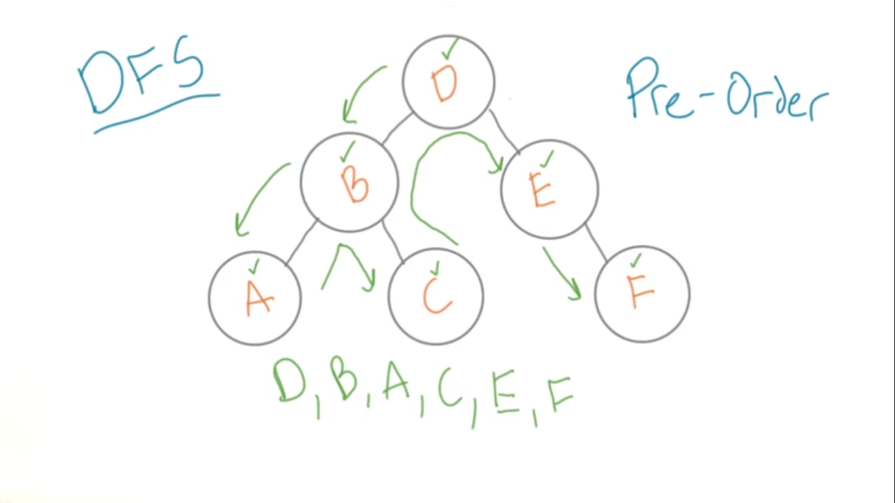
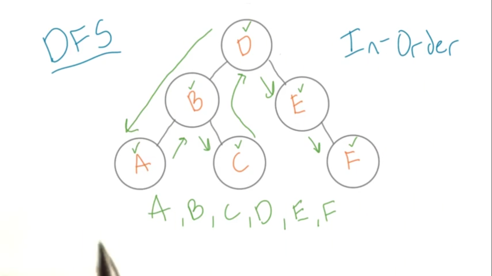

# A note on Data Structures & Algorithms

## Big-O Notation

View contents

> used to classify algorithms according to how their **run time** or **space** requirements grow as the input size grows.

#### Time Complexity

> analyze the runtime as the size of the inputs increases.

- Arithmetic operations are constant.
- Variable assignment is constant.
- Accessing elements in an array (by index) or object (by key) is constant.
- In a loop, the complexity is the length of the loop times.

#### Space Complexity

> how much additional memory do we need to allocate.

- Most primitives (booleans, numbers, undefined, null) are constant space.
- Strings require O(n) space (where n is the string length)
- Reference types are generally O(n), where n is the length (for arrays) or the number of keys (for objects)

#### O (Big Oh), Ω (Big Omega) and Θ (Big Theta)

- Big oh (O) - defines the worst case. e.g.: O(n)
- Big Omega (Ω) - defines the best case. e.g.: Ω(1)
- Big Theta (Θ) - when best case and worst case are same. e.g.: Θ(1)

#### Big-O Complexity Chart

source: [https://www.bigocheatsheet.com/](https://www.bigocheatsheet.com/)

#### Big-O list

- ✅ **O(1) Constant Time:** no loops
- ✅ **O(logN) Logarithmic:** usually searching algorithms have log(n) if they are sorted (Binary Search) [size 8 -> 3 operations (log2^8), size 16 -> 4 operations (log2^16)]
- ✅ **O(n) Linear Time:** for, while loops
- ✅ **O(n \* logN):** Log Linear - usually Sorting algorithms
- ✅ **O(n^2) Quadratic Time:** every element in a collection needs to be compared to every other element. Two nested loops
- ✅ **O(2^n) Exponential Time:** recursive algorithms that solve a problem of size N
- ✅ **O(n!) Factorial Time:** Run a loop for every element
- ✅ **Two separate inputs:** O(a + b) or O(a \* b)

#### Common Data Structure Operations

source: [https://www.bigocheatsheet.com/](https://www.bigocheatsheet.com/)

#### Array Sorting Algorithms

source: [https://www.bigocheatsheet.com/](https://www.bigocheatsheet.com/)

## Graph

> Graph is a data structure designed to show relationships between objects.

View contents

#### DFS (Depth First Search)

DFS Traversal

1. Pre-order

2. In-order

3. Post-order

source: [data structures and algorithms in python](https://classroom.udacity.com/courses/ud513/lessons/7114284829/concepts/77366995150923)

